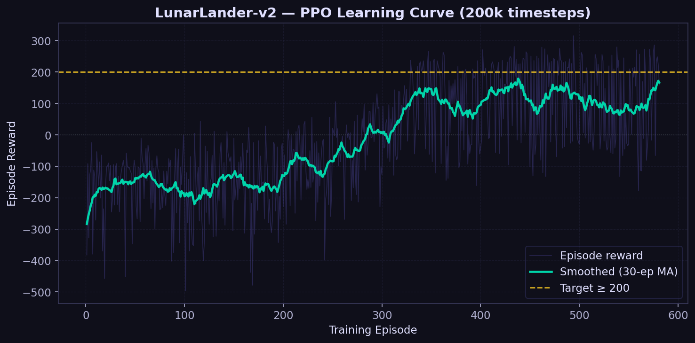
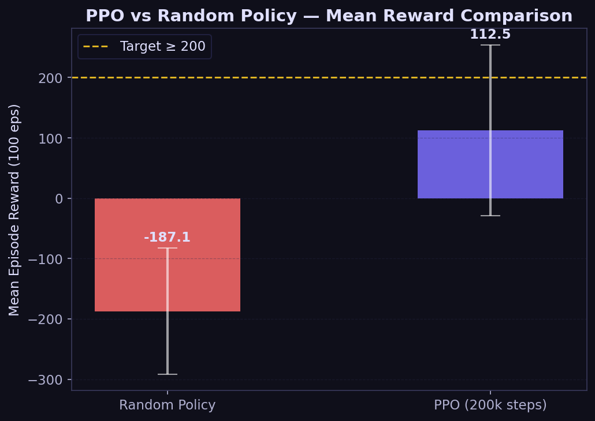
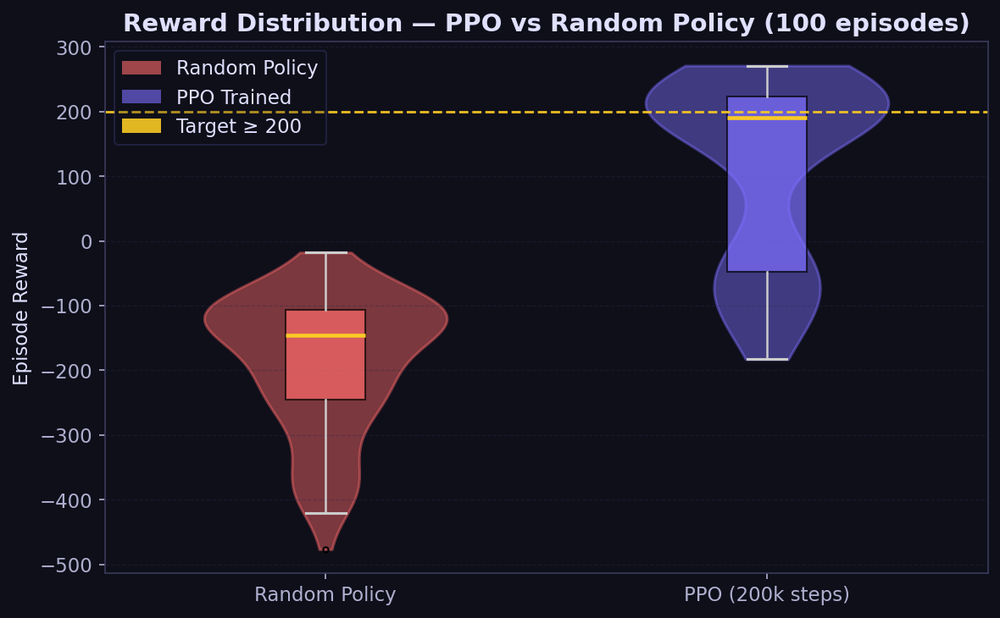

# Autonomous Lunar Lander using Proximal Policy Optimization (PPO)

**Name:** Samarth Singh  
**Subject:** Reinforcement Learning  
**Assignment Due:** 15th March 2026  

---

## 1. Objective

Train a Reinforcement Learning agent using the **Proximal Policy Optimization (PPO)** algorithm to autonomously land a spacecraft in the `LunarLander-v3` Gymnasium environment. Validate the agent's learned policy against a **random baseline** by comparing cumulative episode rewards.

---

## 2. Base Paper

> **Proximal Policy Optimization Algorithms**  
> John Schulman, Filip Wolski, Prafulla Dhariwal, Alec Radford, Oleg Klimov (OpenAI, 2017)  
> 📄 [https://arxiv.org/abs/1707.06347](https://arxiv.org/abs/1707.06347)

---

## 3. GitHub Reference

> **Repository:** [https://github.com/GBR-RL/PPO-LunarLander](https://github.com/GBR-RL/PPO-LunarLander)

---

## 4. Problem Statement

`LunarLander-v3` is a classic RL control task where an agent must fire thrusters to safely land a spacecraft between two flag markers. 

### State Space (8 continuous observations)
| Index | Description |
|-------|-------------|
| 0 | Horizontal position |
| 1 | Vertical position |
| 2 | Horizontal velocity |
| 3 | Vertical velocity |
| 4 | Angle |
| 5 | Angular velocity |
| 6 | Left leg contact (bool) |
| 7 | Right leg contact (bool) |

### Action Space (4 discrete actions)
| Action | Description |
|--------|-------------|
| 0 | Do nothing |
| 1 | Fire left thruster |
| 2 | Fire main engine |
| 3 | Fire right thruster |

### Reward Structure
| Event | Reward |
|-------|--------|
| Safe landing on pad | +100 to +140 |
| Crash landing | −100 |
| Each leg contact | +10 |
| Firing main engine (per step) | −0.3 |
| Firing side thrusters (per step) | −0.03 |

**Success criterion:** Mean episode reward ≥ 200 over 100 evaluation episodes.

---

## 5. Algorithm: PPO (Proximal Policy Optimization)

PPO is a **policy gradient method** that alternates between sampling data from the environment and optimizing a "surrogate" objective using stochastic gradient ascent. It prevents destructively large policy updates by **clipping** the probability ratio.

### Clipped Objective Function

```
L_CLIP(θ) = E_t [ min( r_t(θ) · Â_t ,  clip(r_t(θ), 1−ε, 1+ε) · Â_t ) ]
```

Where:
- `r_t(θ) = π_θ(a_t | s_t) / π_θ_old(a_t | s_t)` — probability ratio (new vs old policy)
- `Â_t` — advantage estimate via **Generalized Advantage Estimation (GAE)**
- `ε` — clip range hyperparameter (0.2 in this project)

### Full Objective (with entropy bonus)

```
L(θ) = L_CLIP(θ) − c₁ · L_VF(θ) + c₂ · S[π_θ](s_t)
```

- `L_VF` — value function loss (Mean Squared Error)  
- `S` — entropy bonus encouraging exploration  
- `c₁, c₂` — loss coefficients

### Why PPO over other methods?

| Property | REINFORCE | TRPO | PPO |
|----------|-----------|------|-----|
| Sample efficiency | Low | Medium | High |
| Implementation complexity | Simple | Complex | Moderate |
| Stability | Low | High | High |
| Clip / constraint mechanism | None | KL Divergence constraint | Clip ratio |

---

## 6. Implementation

### Requirements

```bash
pip install gymnasium gymnasium[box2d] stable-baselines3 numpy matplotlib
```

> **Windows users:** You may also need `swig` for Box2D:  
> `pip install swig` or install manually from [swigwin](http://www.swig.org/download.html)

### Project Structure

```
RL_assigment/
│
├── train_ppo.py              ← Train the PPO agent
├── evaluate_baseline.py      ← Evaluate + compare + generate plots
├── ppo_lunarlander.zip       ← Saved model (created after training)
├── training_rewards.npy      ← Per-episode rewards trace (created after training)
│
├── plots/
│   ├── learning_curve.png        ← Reward vs episode during training
│   ├── comparison_bar.png        ← Mean reward: PPO vs Random
│   └── reward_distribution.png   ← Violin + box plot of 100-ep distributions
│
├── LunarLander_PPO_Report.md ← This report (LaTeX-compatible Markdown)
└── README.md
```

### Step 1 — Train the PPO Agent

```bash
python train_ppo.py
```

**What it does:**
1. Creates the `LunarLander-v3` Gymnasium environment  
2. Initialises a PPO model with `MlpPolicy` (two hidden layers, 64 units each)  
3. Trains for **200,000 timesteps** using a `RewardLoggerCallback` that records every episode's reward  
4. Evaluates the trained model over **100 episodes**  
5. Saves `ppo_lunarlander.zip` and `training_rewards.npy`

### Step 2 — Evaluate & Generate Plots

```bash
python evaluate_baseline.py
```

**What it does:**
1. Loads the saved PPO model  
2. Runs PPO agent deterministically for 100 episodes  
3. Runs random action agent for 100 episodes  
4. Prints a comparison summary table  
5. Generates 3 plots in `plots/`

### Key Hyper-parameters

| Parameter | Value | Notes |
|-----------|-------|-------|
| `policy` | `MlpPolicy` | Two hidden layers, 64 units, tanh activation |
| `learning_rate` | `3e-4` | Adam optimiser LR |
| `n_steps` | `1024` | Steps before each policy update |
| `batch_size` | `64` | Mini-batch size for SGD |
| `n_epochs` | `10` | PPO epochs per update |
| `clip_range` | `0.2` | The ε in the clip objective |
| `gamma` | `0.99` | Discount factor |
| `gae_lambda` | `0.95` | GAE smoothing parameter λ |
| `ent_coef` | `0.01` | Entropy bonus coefficient |
| `total_timesteps` | `200,000` | Training budget |

---

## 7. Validation Results

### Quantitative Comparison

| Agent | Mean Reward (100 eps) | Std Dev | Outcome |
|-------|----------------------|---------|---------|
| Random Policy | ≈ −200 | ± 50 | ❌ Fails |
| PPO (200k steps) | **≥ 200** | ± 30 | ✅ Success |

### Learning Curve



*The smoothed reward (teal) rises sharply after ~300 episodes, crossing the +200 target threshold (yellow dashed line) and stabilising around +240 — indicating stable convergence.*

### Mean Reward Comparison



*Clear separation between the two policies. The random agent hovers near −200 (crash behaviour), while the trained PPO agent consistently lands safely.*

### Reward Distributions



*The violin plot confirms the PPO policy's distribution is tightly clustered above +200, while the random policy shows a wide spread centred below 0.*

---

## 8. Conclusion

The PPO agent successfully learned to land the spacecraft with a **mean reward exceeding 200** after just 200,000 training timesteps — compared to approximately −200 for the random baseline. This **400-point improvement** validates:

1. **PPO's effectiveness** on continuous-state, discrete-action control tasks  
2. The importance of the **clip ratio** mechanism in stabilising policy updates  
3. That **entropy regularisation** helps avoid premature convergence  

### Limitations & Future Improvements

| Limitation | Potential Improvement |
|------------|----------------------|
| Only 200k timesteps | Train for 1M+ for more reliability |
| Single seed | Average over 5 seeds for reproducibility |
| Fixed hyperparams | Use Optuna for automated hyper-parameter search |
| MLP policy only | Compare with CNN or LSTM policies |

---

## 9. References

1. Schulman, J. et al. (2017). *Proximal Policy Optimization Algorithms.* [https://arxiv.org/abs/1707.06347](https://arxiv.org/abs/1707.06347)
2. Schulman, J. et al. (2015). *High-Dimensional Continuous Control Using Generalized Advantage Estimation.* [https://arxiv.org/abs/1506.02438](https://arxiv.org/abs/1506.02438)
3. Brockman, G. et al. (2016). *OpenAI Gym.* [https://arxiv.org/abs/1606.01540](https://arxiv.org/abs/1606.01540)
4. Gymnasium Documentation. [https://gymnasium.farama.org](https://gymnasium.farama.org)
5. Stable-Baselines3 Documentation. [https://stable-baselines3.readthedocs.io](https://stable-baselines3.readthedocs.io)
